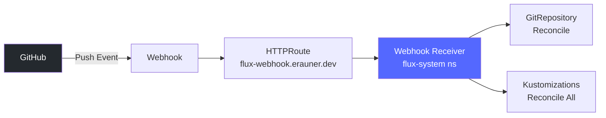

# Flux Webhook Setup

## Overview

This document describes the push-reactive webhook configuration for Flux, enabling instant reconciliation when changes are pushed to the repository.

## Architecture



## Components

### 1. 1Password Secret (Terraform)
- **File**: `terraform/onepassword/flux-webhook.tf`
- **Pattern**: Login item with dummy username (ESO-compatible)
- **Secret**: 32-character alphanumeric token

### 2. ExternalSecret
- **File**: `infrastructure/base/flux-system/webhook/externalsecret.yaml`
- **Target Secret**: `flux-webhook-secret`
- **Namespace**: `flux-system`

### 3. Webhook Receiver
- **File**: `infrastructure/base/flux-system/webhook/receiver.yaml`
- **Type**: GitHub webhook
- **Events**: `push`, `ping`
- **Resources**:
  - GitRepository: `homelab-k8s`
  - Kustomizations: `*` (all)

### 4. HTTPRoute
- **File**: `infrastructure/base/flux-system/webhook/httproute.yaml`
- **URL**: `https://flux-webhook.erauner.dev/hook`
- **Backend**: `webhook-receiver` service

## Deployment Steps

### 1. Apply Terraform
```bash
cd terraform/onepassword
terraform apply -target=onepassword_item.flux_webhook_secret
```

### 2. Wait for Infrastructure Sync
```bash
# Wait for Flux to reconcile the new resources
flux reconcile kustomization infrastructure --with-source

# Verify ExternalSecret synced
kubectl get externalsecret flux-webhook-secret -n flux-system
kubectl get secret flux-webhook-secret -n flux-system
```

### 3. Configure GitHub Webhook
```bash
# Run the setup script
./scripts/setup-flux-webhook.sh

# Or manually via gh CLI
gh api repos/erauner/homelab-k8s/hooks \
  --method POST \
  -f name="web" \
  -f config[url]="https://flux-webhook.erauner.dev/hook" \
  -f config[content_type]="json" \
  -f config[secret]="$(kubectl get secret flux-webhook-secret -n flux-system -o jsonpath='{.data.token}' | base64 -d)" \
  -f active=true \
  -f events[]="push" \
  -f events[]="ping"
```

## Testing

### 1. Test with Ping
```bash
# Get webhook ID
WEBHOOK_ID=$(gh api repos/erauner/homelab-k8s/hooks --jq '.[] | select(.config.url == "https://flux-webhook.erauner.dev/hook") | .id')

# Send ping
gh api repos/erauner/homelab-k8s/hooks/$WEBHOOK_ID/pings --method POST
```

### 2. Monitor Logs
```bash
# Watch webhook receiver logs
kubectl logs -n flux-system deployment/webhook-receiver -f

# Watch source controller for reconciliation
kubectl logs -n flux-system deployment/source-controller -f | grep homelab-k8s
```

### 3. Test with Push
```bash
# Make a trivial change
echo "# Test" >> README.md
git add README.md
git commit -m "test: webhook trigger"
git push

# Watch for immediate reconciliation
flux events --for GitRepository/homelab-k8s
```

## Troubleshooting

### Webhook Not Triggering
1. Check webhook deliveries in GitHub: https://github.com/erauner/homelab-k8s/settings/hooks
2. Verify HTTPRoute is working: `curl -I https://flux-webhook.erauner.dev/hook`
3. Check receiver logs: `kubectl logs -n flux-system deployment/webhook-receiver`

### Secret Not Found
1. Verify ExternalSecret synced: `kubectl describe externalsecret flux-webhook-secret -n flux-system`
2. Check 1Password item exists: `op item get "Flux Webhook Secret" --vault Homelab`
3. Force resync: `kubectl annotate externalsecret flux-webhook-secret -n flux-system force-sync=$(date +%s) --overwrite`

### Reconciliation Not Happening
1. Check receiver configuration: `kubectl describe receiver github-homelab -n flux-system`
2. Verify GitRepository is listed in resources
3. Check source-controller logs for errors

## Security Considerations

1. **Secret Rotation**: To rotate the webhook secret:
   ```bash
   # Update Terraform
   cd terraform/onepassword
   # Edit flux-webhook.tf and bump a keeper or regenerate
   terraform apply

   # Wait for ESO to sync
   sleep 60

   # Update GitHub webhook
   ./scripts/setup-flux-webhook.sh
   ```

2. **Access Control**: The webhook endpoint is public but requires the shared secret for validation

3. **Rate Limiting**: GitHub has webhook delivery limits. Monitor for 429 responses.

## Integration with ArgoCD

The webhook triggers Flux reconciliation for infrastructure changes. ArgoCD then:
1. Detects the infrastructure changes via its own polling (60s interval)
2. OR receives its own webhook (if configured)
3. Syncs applications based on the new infrastructure state

This creates a push-reactive GitOps pipeline:
- **Flux**: Infrastructure changes reconcile in ~5 seconds
- **ArgoCD**: Application changes reconcile in ~60 seconds (or instant with ArgoCD webhook)
